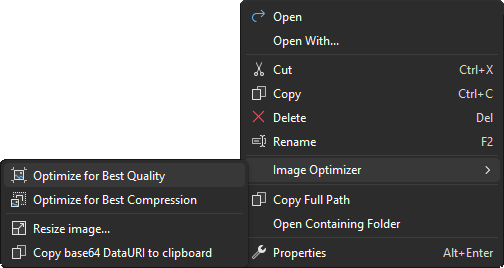

# Image Optimizer for Visual Studio

Optimizes any JPEG, PNG and GIF image files.

Download this extension from the [VS Gallery](https://visualstudiogallery.msdn.microsoft.com/a56eddd3-d79b-48ac-8c8f-2db06ade77c3)
or get the [nightly build](http://vsixgallery.com/extension/bf95754f-93d3-42ff-bfe3-e05d23188b08/).

## Features

Adds a right-click menu to any folder and image in Solution Explorer
that let's you automatically optimize all PNG, GIF and JPEG files
in that folder. The optimization doesn't effect the quality of the images,
but optimizes them using industry proven algorithms for removing EXIF
and other metadata.

- Optimizes PNGs (uses Zopfli compression)
- Optimizes GIFs
- Optimizes animated GIFs
- Optimizes JPGs
- Works on single images files or entire folders
- Copy any image as base64 dataURI to clipboard

### Context menu
Simply right-click any file or folder containing images and click the
*Optimize Image* button.

You can also right-click a folder to optimize all images inside it.

### Output window
The Output Window shows the detailed output from the optimization process.

## Contribute
Check out the [contribution guidelines](.github/CONTRIBUTING.md)
if you want to contribute to this project.

For cloning and building this project yourself, make sure 
to install the
[Extensibility Tools 2015](https://visualstudiogallery.msdn.microsoft.com/ab39a092-1343-46e2-b0f1-6a3f91155aa6)
extension for Visual Studio which enables some features
used by this project.

## License
[Apache 2.0](LICENSE) 