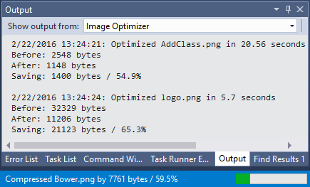

[marketplace]: https://marketplace.visualstudio.com/items?itemName=MadsKristensen.ImageOptimizer64bit
[vsixgallery]: http://vsixgallery.com/extension/fc4e241f-57de-4032-9c89-527984c0a0ae/
[repo]:https://github.com/madskristensen/ImageOptimizer

# Image Optimizer for Visual Studio

[](https://github.com/madskristensen/ImageOptimizer/actions/workflows/build.yaml)


Download this extension from the [Visual Studio Marketplace][marketplace]
or get the [CI build][vsixgallery]

--------------------------------

Uses industry standard tools to optimize any JPEG, PNG, WebP, AVIF, SVG,
and GIFs - including animated GIFs. It can do both lossy
and lossless optimization.

## Features

Adds a right-click menu to any folder and image in Solution Explorer
that lets you optimize all images in that folder. 

- **Optimize** PNG, JPG, WebP, AVIF, SVG, and GIF (including animated GIFs) images
- **Convert** PNG and JPG images to **WebP** or **AVIF** format
- Works on single image files or entire folders
- **Resize** images easily
- Copy any image as **base64 dataURI** to clipboard
- **Real-time progress** in the Output Window and status bar
- **Smart caching** to skip already-optimized files
- **Backup support** to preserve original files

## Optimize Images

Simply right-click any file or folder containing images and click 
one of the image optimization buttons.


You can also right-click a folder to optimize all images inside it.

### Best Quality (Lossless)

If you choose best quality optimization, the tool will
do its optimizations without changing the quality of the image.
This is ideal for production assets where every pixel matters.

### Best Compression (Lossy)

If you decide to sacrifice just a small amount of image quality
(which in most cases is unnoticeable to the human eye), you will
be able to save up to 90% of the initial file weight. Lossy
optimization will give you outstanding results with just a
fraction of image quality loss.

You can control the quality level (60-100) in the options.

## Convert to WebP / AVIF

Right-click any PNG or JPG file (or a folder containing them) and choose
**Convert to WebP** or **Convert to AVIF** from the Image Optimizer menu.

- Creates a `.webp` or `.avif` file next to the original
- Original file is preserved — you decide when to remove it
- New file is automatically added to the project
- Works on single files, folders, projects, and solutions
- Uses the lossy quality setting from Options (default: 85)

WebP and AVIF typically offer significantly better compression than PNG/JPG,
making them ideal for web assets.

## Image Resize

You can resize images by using the *Resize Image* dialog. You get to it by right-clicking any single image (JPG, GIF, and PNG only).


## Output Window

The Output Window shows detailed results in a formatted table as files
are optimized in real-time. Progress is also displayed in the status bar.



The output shows each file's before/after size, bytes saved, and percentage reduction.

## Performance

Optimizing an image can easily take several seconds which feels
slow. This extension parallelizes the workload across multiple CPU cores
available on the machine. This speeds up the optimization
significantly.

Additionally, the smart caching feature remembers which files have
already been optimized, so subsequent runs skip unchanged files entirely.

## Options

Configure the extension via **Tools > Options > Image Optimizer**.

### Compression

| Option | Description | Default |
|--------|-------------|---------|
| **Lossy Quality** | Quality level for lossy compression (60-100). Higher values preserve more quality but reduce savings. | 85 |

### Performance

| Option | Description | Default |
|--------|-------------|---------|
| **Process Timeout** | Maximum seconds to wait for compression before timing out (10-300). | 60 |
| **Max Parallel Threads** | Number of parallel threads for processing. 0 = automatic (uses processor count). | 0 |

### Cache

| Option | Description | Default |
|--------|-------------|---------|
| **Enable Caching** | Cache optimization results to avoid reprocessing unchanged files. | On |
| **Cache Validation** | Validate cached files by checking file size. Disable for faster operation. | On |

### Safety

| Option | Description | Default |
|--------|-------------|---------|
| **Create Backup** | Create backup copies before optimization. Backups are stored in the `.vs` folder. | Off |

### User Interface

| Option | Description | Default |
|--------|-------------|---------|
| **Show Progress in Status Bar** | Display real-time optimization progress in the status bar. | On |
| **Show Detailed Results** | Show per-file compression results in the Output Window. | On |

### Error Handling

| Option | Description | Default |
|--------|-------------|---------|
| **Continue on Error** | Continue processing other images if one fails. | On |
| **Log Errors to Output** | Log detailed error information to the Output Window. | On |

## API for Extenders
Any extension can call the commands provided in the Image Optimizer extension to optimize any image. The [Markdown Editor v2](https://marketplace.visualstudio.com/items?itemName=MadsKristensen.MarkdownEditor2) extension uses this API.

```c#
public void OptimizeImage(string filePath)
{
	try
	{
		var DTE = (DTE2)Package.GetGlobalService(typeof(DTE));
		Command command = DTE.Commands.Item("ImageOptimizer.OptimizeLossless");

		if (command != null && command.IsAvailable)
		{
			DTE.Commands.Raise(command.Guid, command.ID, filePath, null);
		}
	}
	catch (Exception ex)
	{
		// Image Optimizer not installed
	}
}
```

The commands are:

* ImageOptimizer.OptimizeLossless - *Optimize for best quality*
* ImageOptimizer.OptimizeLossy - *Optimize for best compression*
* ImageOptimizer.ConvertToWebP - *Convert PNG/JPG to WebP*
* ImageOptimizer.ConvertToAvif - *Convert PNG/JPG to AVIF*

## How can I help?
If you enjoy using the extension, please give it a ★★★★★ rating on the [Visual Studio Marketplace][marketplace].

Should you encounter bugs or if you have feature requests, head on over to the [GitHub repo][repo] to open an issue if one doesn't already exist.

Pull requests are also very welcome, since I can't always get around to fixing all bugs myself. This is a personal passion project, so my time is limited.

Another way to help out is to [sponsor me on GitHub](https://github.com/sponsors/madskristensen).